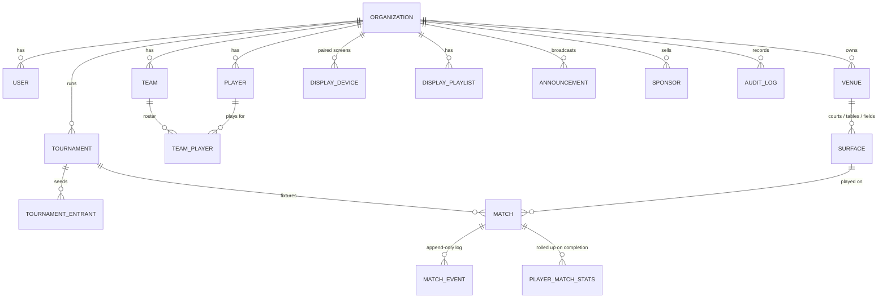

# ArenaOS — Architecture

One platform, 11 sports, one scoring engine, real-time everywhere, one tap to the big screen.

## 1. Current architecture assessment

The workspace was empty when this work began: there was no existing repository, so there was nothing to preserve, migrate, or reuse. Everything below is new. That made it possible to put the sport-agnostic core in place first, and every sport was then added as a plug-in from day one.

## 2. Reusable modules (now in the repo)

| Module | Where | Reused by |
|---|---|---|
| Universal match engine (event-sourced aggregate) | `packages/engine/src/core/aggregate.ts` | API server, offline scorer (same code in the browser), seed, tests |
| Sport rule engines (11 sports, 47 disciplines) | `packages/engine/src/sports/*` | everything above |
| Universal `DisplayState` | `packages/engine/src/core/types.ts` | TV, multi-court tiles, public page, broadcast overlay, share cards, console |
| Event-sourced game clock + possession | `packages/engine/src/core/clock.ts` | football, basketball (any timed sport) |
| Tournament engine (pure) | `packages/engine/src/tournament/index.ts` | tournament service, tests |
| Match simulator / fuzzer | `packages/engine/src/sim.ts` | demo seed, property tests |
| Real-time client (reconnect, clock sync) | `apps/web/src/lib/rt.ts` | TV, scorer, live page, console |
| Scoreboard renderer | `apps/web/src/lib/board.ts` | TV, tiles, overlay, live page, console, scorer |
| Cast-to-TV sheet | `apps/web/src/lib/cast.ts` | scorer, console |

## 3. Missing modules (honest status)

See §9 for the full phase table. The main gaps are: Swiss and double-elimination formats, automatic group→knockout progression, billing/subscriptions, white-label domains, push notifications, the LLM provider for AI commentary and the agent interface, a native Google Cast receiver app, PostgreSQL/Redis adapters (interfaces exist), the DLS calculation itself (the hook exists), file uploads, and console translations (the TV and public pages are translated).

## 4. Technology architecture

| Concern | Phase 1 (running now) | Production target |
|---|---|---|
| Language | TypeScript end to end | same |
| Rule engines | Pure TS package, runs on Node **and** in the browser | same (also usable in React Native) |
| API | Node `http` + small router, JSON | same handlers behind Fastify or Hono |
| Real-time | `ws` WebSocket hub with topic pub/sub | same hub; `Bus` backed by Redis/NATS for multi-node |
| Persistence | SQLite (`node:sqlite`), WAL, one transaction per batch | PostgreSQL (same SQL), partitioned `match_events` |
| Web apps | Vanilla TS bundled by esbuild (TV bundle ≈20 KB, ES2017) | Console may move to React; TV stays tiny on purpose |
| Offline | Same engine on device + localStorage queue + service worker | IndexedDB queue, Background Sync |
| Auth | scrypt passwords, hashed bearer sessions, RBAC | + SSO/OIDC, device-bound refresh tokens |
| Deploy | Single Node process | Containers behind a load balancer, sticky WS optional (bus fan-out) |

**Why the TV app is not a framework app:** smart-TV browsers (Tizen, webOS, old Android TV WebViews) are slow and old. A 20 KB ES2017 bundle boots fast and keeps working on hardware a venue already owns.

## 5. Database ER model



Key decisions:

- **`match_events` is the source of truth.** Primary key `(match_id, seq)`, unique `(match_id, client_event_id)` for idempotency. Scores are never updated in place.
- **`matches.score / display / status / version` are a read model**, written in the same transaction as the events, so lists, standings and screens never have to replay a log.
- **Sport is configuration, not schema.** `matches.config` holds the resolved rule set, so changing a discipline's defaults never rewrites history.
- **Tenant isolation.** Every tenant-owned row carries `org_id`, and every service query filters on the caller's org. Public projections expose only `public_code`, never internal ids.
- **Display entities.** `display_devices` (pairing code, secret hash, assignment, orientation, aspect, theme, lock, heartbeat), `display_playlists`, `announcements`. Sessions and heartbeats are live state in the hub; only the last heartbeat is persisted.
- Spec entities not yet tables: `Season`, `Ranking` history, `Subscription`, `Payment`, `Media`, `Notification`. Ratings currently live in `players.rating` (Elo per sport).

## 6. Universal scoring architecture

```
scorer tap ──► EventInput {type, payload, id, clientEventId, deviceTime}
                 │
                 ▼
     MatchAggregate.append()            (same code on device and server)
       ├─ core rules: started? paused? finished? duplicate?
       ├─ SportRuleEngine.validateEvent(state, event)
       ├─ SportRuleEngine.applyEvent(state, event) → new state   (pure)
       └─ isMatchComplete → status
                 │
     projections: calculateScore · calculateStatistics · getDisplayState · getActions · describeEvent
```

- **The `SportRuleEngine` contract** (`core/types.ts`) has `initializeMatch, validateEvent, applyEvent, calculateScore, calculateStatistics, determineWinner, isMatchComplete, getCurrentState, getDisplayState`, plus `getActions` (the scorer UI is generated from it) and `describeEvent` (the verified timeline).
- **Undo, redo and corrections** append `VOID`/`UNVOID` events. State is rebuilt from the events that are still in effect. If a correction makes a later event illegal, that event is reported in `issues` and excluded. It is never silently reshaped.
- **Adding a sport** means one engine file and one line in `packages/engine/src/index.ts`. The API, TV, scorer, live page, tournaments and standings need no changes.
- **Engine families:** `rally.ts` (badminton, table tennis, volleyball), `tennis.ts` (tennis, padel), `pickleball.ts`, `football.ts`, `basketball.ts`, `cricket.ts`, `cue.ts` (snooker plus organizer-configurable billiards, carom and pool).

## 7. TV / display architecture

```
SCORER ──HTTP──► API ──tx──► match_events + read model
                  │
                  └─publish──► Hub topics ──► match:<code>  tournament:<code>  org:<id>  display:<id>
                                   │
           ┌───────────────┬───────┴────────┬──────────────────┐
       PUBLIC PAGE      CONSOLE         TV (device mode)   TV (direct URL) / OVERLAY
```

- **Every client consumes the same topics and the same `DisplayState`.** A screen is just a subscriber whose topics are chosen by the server from its assignment.
- **Pairing.** The TV registers and gets an id, a secret and a 6-digit PIN that expires after 30 minutes and is renewed automatically. The organizer types the PIN or scans the QR on the TV, which opens `/pair?code=…` on their phone.
- **Casting.** One-tap send to an already paired screen, PIN pairing, the browser Presentation API (Chrome casting), or the public TV link and its QR code.
- **Assignment modes:** `match`, `multi` (up to 16 matches), `venue` (every court's live or next match, updated automatically as matches start and end), `tournament` (standings), `playlist` (timed rotation of match, grid, standings, upcoming, results, sponsor and announcement views), `announcement`, `idle`.
- **Resilience.** The last configuration and every match state are cached on the device and drawn immediately on boot. The socket reconnects indefinitely with jittered backoff. On reconnect, the server sends an authoritative snapshot before any further updates. The screen never needs a manual refresh.
- **Health.** The device sends a heartbeat every 15 seconds and the hub tracks live sockets. A screen is shown as `online` (connected with a heartbeat in the last 45 seconds), `syncing` (connected, heartbeat stale), or `offline`.
- **Admin control:** pair, rename, assign, change orientation and aspect, lock, force reload, unpair, and push emergency or notice messages to all screens or a chosen set.
- **Clock.** Clocks are derived from event device times. Clients render them from `anchorAt` plus the server time offset, so every screen shows the same second.

## 8. Folder structure

```
packages/engine/        isomorphic rules: core/ sports/ tournament/ sim.ts
apps/api/src/           app.ts (routes + WS), db.ts, auth.ts, realtime.ts, context.ts
  services/             matches, tournaments, displays, insights
apps/web/src/           console.ts, score.ts, tv.ts, live.ts, lib/ (rt, board, cast, api, i18n)
apps/web/public/        html shells, styles.css, sw.js, manifest, built js/
scripts/                seed.ts, build-web.mjs
test/engine/            per-sport rules, core, tournament, fuzz (all 47 disciplines)
test/api/               end-to-end workflow, displays, security/offline
```

Target monorepo split when teams grow: `packages/engine`, `packages/realtime-client`, `apps/api`, `apps/console`, `apps/tv`, `apps/scorer`. The current layout already follows those boundaries.

## 9. Implementation roadmap and status

| Phase | Area | Status |
|---|---|---|
| 1 | Core architecture | ✅ |
| 2 | Database | ✅ SQLite; PostgreSQL port pending |
| 3 | Auth / RBAC | ✅ 10 roles, granular permissions, assignment-scoped scorers |
| 4 | Organizations | ✅ multi-tenant; white-label pending |
| 5–7 | Sport framework, match engine, event engine | ✅ |
| 8 | Real-time engine | ✅ single node; Redis bus adapter pending |
| 9 | TV display engine | ✅ pairing, casting, multi-screen, playlists, venue rotation, health, announcements, overlay |
| 10 | Tournament engine | 🟡 round robin, home-and-away, knockout with byes and auto-advance, groups, multi-court scheduler. Swiss, double elimination and group→knockout progression pending |
| 11–21 | All 11 sports | ✅ see test/engine; DLS calculation pending (target hook exists) |
| 22 | Statistics | 🟡 match stats and player rollups; season/career views partial |
| 23 | Rankings | 🟡 Elo per sport; configurable formulas pending |
| 24 | AI | 🟡 verified-facts layer, template summary, player of the match, citations. LLM provider, commentary and agent pending |
| 25 | Social | 🟡 share links and SVG share card; PNG rendering pending (some apps reject SVG) |
| 26 | Broadcasting | 🟡 OBS overlay URL; RTMP pending |
| 27 | Billing | ⛔ not started |
| 28–30 | Testing, security, performance | 🟡 118 tests (incl. fuzzing every discipline), OWASP basics, rate limits; load tests pending |
| 31 | Production deployment | ⛔ Dockerfile and CI pending |

**Recommended next steps, in order:** PostgreSQL + Redis adapters (needed for more than one node) → group→knockout progression and Swiss → PNG share cards → LLM provider behind the existing `InsightProvider` → billing.
